# Polymarket Settlement Source

This document defines the `liquent-reth` source type `6` boundary for mirroring
one finalized Polygon Conditional Tokens Framework (CTF) condition into
Liquent. The source only transports canonical settlement facts. Human-readable
market metadata, outcome labels, and Liquent betting-product behavior are not
inferred from Polygon logs.

## Workflow

```mermaid
flowchart LR
    A["OracleTaskConfig URI"] --> B["Each validator's Polygon RPC"]
    B --> C["eth_chainId = 137"]
    C --> D["finalized block watermark"]
    D --> E["bounded ConditionResolution log scan"]
    E --> F["strict event and condition validation"]
    F --> G["canonical source type 6 bytes"]
    G --> H["JWK voting-power quorum"]
    H --> I["NativeOracle recordBatch"]
    I --> J["PolymarketSettlementResolver"]
```



## Task URI

```text
liquent://6/9001/polymarket_settlement?ctf=0x4D97DCd97eC945f40cF65F87097ACe5EA0476045&condition=0x...&fromBlock=89000000&chainId=137&maxBlocksPerPoll=1000
```

The URI is governance-controlled consensus configuration. It contains no RPC
URL or credential. Each validator maps this URI to its own Polygon endpoint in
local node configuration.

| Field | Meaning |
|---|---|
| `6` | `NativeOracle` source type for Polygon CTF settlement mirrors |
| `9001` | Stable `mirrorId` and `NativeOracle.sourceId`, restricted to `uint64` |
| `ctf` | Polygon CTF contract that must emit the event |
| `condition` | Exact indexed CTF condition ID to scan |
| `fromBlock` | Initial scan cursor; the first queried block is `fromBlock + 1` |
| `chainId` | Optional but, when present, must be `137` |
| `maxBlocksPerPoll` | Optional bounded scan size, default `1000`, maximum `10000` |

Only the parameters above are accepted. Use a new `mirrorId` and URI when the
CTF condition identity changes. If the earliest possible event is block `X`, set
`fromBlock` to `X - 1` so that block `X` is included in the first scan.

## Market Discovery Boundary

A Polygon `ConditionResolution` event identifies a CTF condition and its payout
vector, but it does not provide a Polymarket question, slug, outcome labels, or
display rules. Before registering a mirror, an operator must resolve that
metadata through a reviewed Polymarket discovery path and record the exact
`ctf`, `conditionId`, outcome count, and product mapping in governance data.

The relayer then watches only that reviewed condition. It does not enumerate all
Polygon conditions or decide which Polymarket market a condition represents.

## Finality And Idempotency

- The endpoint must report Polygon chain ID `137` before any scan is accepted.
- The upper watermark comes from `eth_getBlockByNumber("finalized", false)`.
- Every scan is bounded by `maxBlocksPerPoll`.
- Returned logs must fall inside the requested finalized range even if the RPC
  server returns extra data.
- Logs are ordered by `(blockNumber, logIndex, transactionHash)`.
- Exact duplicate log identities are deduplicated.
- More than one distinct terminal log for one condition fails closed without
  advancing the cursor.
- Empty finalized scans still advance and persist the cursor, preventing the
  same empty range from being rescanned after restart.
- A mirror is terminal. Its only delivery nonce is `1`; after on-chain progress
  reaches nonce `1`, the source performs no more RPC calls.

`NativeOracle.latestPosition` stores the settlement's finalized Polygon block.
The relayer persistence file separately stores the later scan cursor. On
restart, the generic relayer manager reconciles local state against authoritative
`(latestNonce, latestPosition)` contract state and rescans from the configured
watermark when an unconfirmed local observation was ahead.

## Canonical Callback Payload

The provider first ABI-encodes the resolver payload:

```solidity
struct PolymarketSettlementPayload {
    uint256 mirrorId;
    uint256 polygonChainId;
    address ctf;
    address oracle;
    bytes32 conditionId;
    bytes32 questionId;
    uint256 outcomeSlotCount;
    uint256[] payoutNumerators;
    bytes32 txHash;
    uint256 logIndex;
    uint8 settlementKind;
}
```

`settlementKind` is `1` for CTF `ConditionResolution`. The source validates:

- exact CTF address, event signature, and indexed condition
- non-removed log with block number, transaction hash, and log index
- nonzero oracle, question ID, and transaction hash
- `conditionId == keccak256(abi.encodePacked(oracle, questionId, outcomeSlotCount))`
- outcome count between `2` and `32`
- payout length equal to outcome count and at least one positive payout

The resolver payload is wrapped as:

```solidity
abi.encode(uint128(1), uint256(finalizedPolygonBlock), bytes(resolverPayload))
```

Validators agree on these exact bytes through the existing unsupported-JWK
consensus path. Execution unwraps the tuple and calls `NativeOracle.recordBatch`
with the standard `500000` callback gas limit. The Contracts resolver test
covers the maximum 32-outcome payload under that limit.

## Failure Semantics

Malformed logs, wrong-chain RPCs, noncanonical identity, out-of-range logs,
ambiguous terminal events, and RPC errors return an error without moving the
source cursor or terminal nonce. A resolver callback failure reverts the whole
`NativeOracle` delivery, so on-chain source progress also remains retryable.

## Verification

```bash
cargo test -p reth-pipe-exec-layer-relayer
cargo test -p reth-pipe-exec-layer-ext-v2 onchain_config::jwk_oracle
cargo +nightly fmt --all -- --check
```

The relayer suite uses an injected deterministic Polygon RPC to test finalized
watermarks, bounded empty scans, duplicate and ambiguous logs, wrong-chain
rejection, range validation, restart reconciliation, and byte-for-byte ABI
compatibility without contacting an external network.
